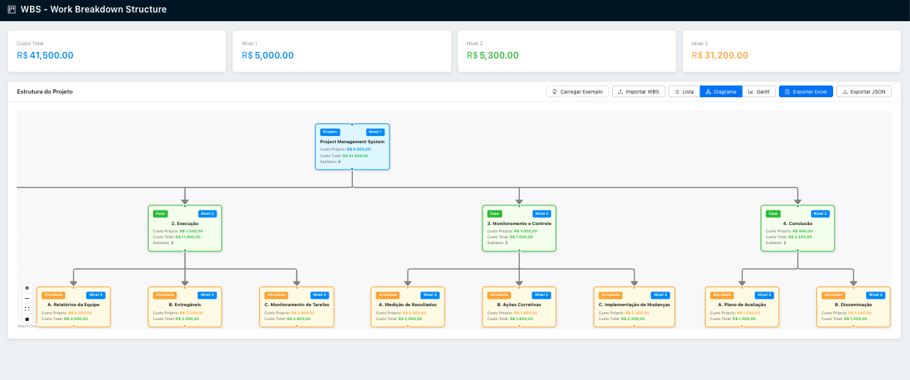
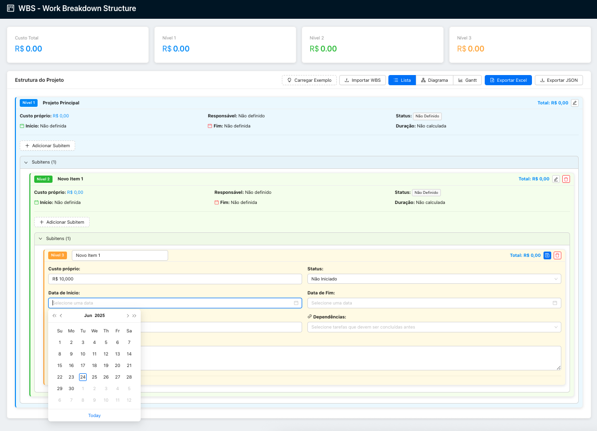
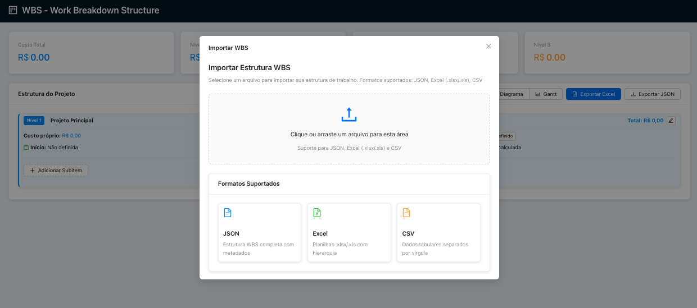
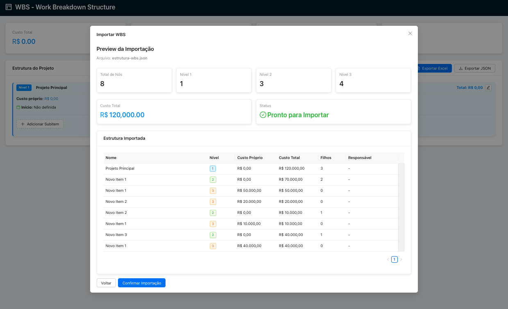
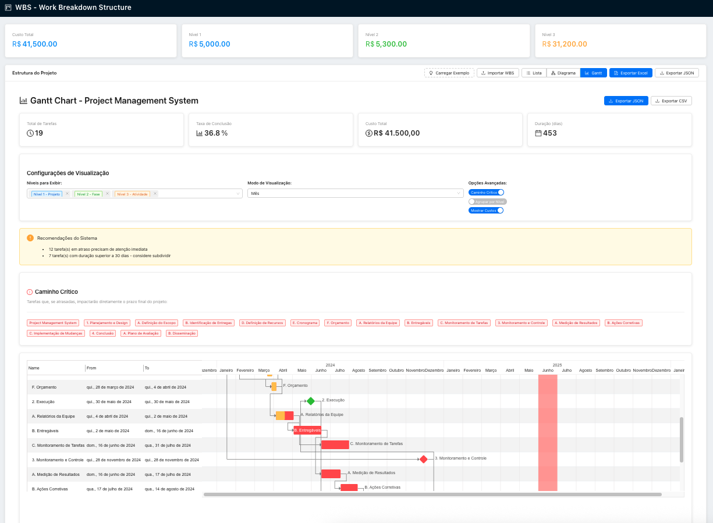

# WBS Dynamic Tree: Hierarchical Cost Management Platform

[](https://reactjs.org/)
[](https://www.typescriptlang.org/)
[](https://ant.design/)
[](https://www.i18next.com/)
[]()
[]()
[](https://opensource.org/licenses/MIT)

WBS Dynamic Tree is a powerful web application designed to help project managers and teams create, manage, and visualize hierarchical Work Breakdown Structures (WBS) with automatic cost aggregation, advanced export capabilities, and comprehensive budget analysis tools.

---

## 🎯 Key Features

### Core Functionality
- **📊 Dynamic Hierarchical Structure**: Create unlimited 3-level hierarchical structures with parent-child relationships
- **💰 Automatic Cost Aggregation**: Real-time cost calculation and rollup from child to parent nodes
- **📤 Multi-format Export**: Export to Excel (.xlsx), JSON, and CSV with professional formatting
- **📥 Smart Import**: Import existing structures from Excel, CSV, or JSON with automatic column detection
- **📦 Phase Grouping**: Group phases into consolidated nodes for simplified visualization while preserving cost aggregation

### Advanced Visualizations
- **📈 Gantt Chart**: Timeline view of your project structure with dependencies and critical path
- **🌲 Tree View**: Interactive hierarchical display with expand/collapse functionality and phase grouping
- **🌊 Flow Tree**: Visual flow representation of project structure with grouped phase support
- **📋 Table View**: Comprehensive tabular display with hierarchical indicators and phase collapsing
- **💹 Budget Allocation**: Advanced budget analysis with temporal distribution and interactive charts

### Budget Analysis & Reporting
- **📊 Temporal Budget Distribution**: Analyze budget allocation across different time periods (monthly, quarterly, yearly)
- **📈 Interactive Charts**: Sand charts and cumulative budget visualization with series toggle
- **🎯 Multi-level Analysis**: View costs by project level or individual phases
- **📅 Date Range Filtering**: Focus analysis on specific time periods
- **💼 Executive Dashboard**: Key metrics and budget variance analysis

### Modern Interface
- **🎨 Clean UI**: Intuitive interface built with Ant Design components
- **⚡ Real-time Updates**: Instant recalculation of costs and totals as you edit
- **🔍 Data Validation**: Built-in validation to ensure data consistency and integrity
- **📱 Responsive Design**: Works seamlessly on desktop, tablet, and mobile devices
- **📦 Smart Grouping**: Phase grouping controls for simplified project navigation
- **🔄 Persistent State**: All user preferences and configurations automatically saved

### Internationalization & Currency Support
- **🌍 Multi-language Support**: Full internationalization with 4 supported languages:
  - **🇧🇷 Portuguese (Português)** - Complete localization for Brazilian users
  - **🇺🇸 English** - Native English interface and content
  - **🇪🇸 Spanish (Español)** - Full Spanish translation and localization
  - **🇨🇳 Chinese (中文)** - Comprehensive Chinese language support
- **💱 Independent Currency System**: Currency selection independent of interface language
- **💰 Multi-currency Support**: 6 major currencies with proper localization:
  - **Brazilian Real (BRL)** - R$ with Brazilian formatting
  - **US Dollar (USD)** - $ with American formatting
  - **Euro (EUR)** - € with European formatting
  - **Chinese Yuan (CNY)** - ¥ with Chinese formatting
  - **British Pound (GBP)** - £ with British formatting
  - **Japanese Yen (JPY)** - ¥ with Japanese formatting
- **🔄 Persistent Settings**: Language and currency preferences automatically saved and restored
- **📊 Localized Data**: Numbers, dates, and currencies formatted according to selected locale



## 🚀 Quick Start

### Prerequisites

- Node.js 18+ 
- npm or yarn

### Installation

```bash
# Clone the repository
git clone https://github.com/your-username/wbs-dynamic-tree.git

# Navigate to project directory
cd wbs-dynamic-tree

# Install dependencies
npm install

# Start development server
npm start
```

The application will open at `http://localhost:3000`

## 📚 Usage

### Creating a Project Structure

1. **Add Root Level Items**: Start by creating your main project phases or categories
2. **Build Hierarchy**: Add sub-items under each main category
3. **Add Details**: Include costs, descriptions, responsible parties, and dates
4. **Automatic Calculation**: Watch as costs automatically roll up to parent levels



### Multiple View Options

#### 🌲 Tree View
- Interactive hierarchical display
- Expand/collapse functionality
- Real-time editing capabilities
- Visual hierarchy indicators
- **📦 Phase Grouping**: Group selected phases into consolidated "Others" nodes for simplified visualization
- **🔄 Persistent Grouping**: Grouping configuration automatically saved and restored between sessions
- **📊 Cost Preservation**: Aggregated costs maintained when phases are grouped
- **🎯 On-demand Grouping**: Manual selection of phases to group via intuitive modal interface

#### 🌊 Flow Tree View  
- Visual flow representation
- Connection lines between nodes
- Ideal for process visualization
- Clean, modern layout
- **📦 Grouped Phase Visualization**: Consolidated phases displayed as special nodes with tooltips
- **🎨 Visual Differentiation**: Grouped nodes highlighted with dashed borders and purple color scheme
- **📋 Phase Details**: Hover tooltips show all phases included in grouped nodes
- **🔄 Real-time Sync**: Grouping changes immediately reflected in flow visualization

#### 📋 Table View
- Comprehensive tabular display
- Hierarchical indentation with level indicators
- **Phase Collapsing**: Collapse/expand phases (level 2) for better overview
- Sortable columns with dependencies resolution
- Pagination and search capabilities
- Color-coded by hierarchy level

#### 📈 Gantt Chart
- Timeline visualization with dependencies
- Duration and milestone tracking
- Critical path analysis
- Resource allocation overview

#### 💹 Budget Allocation Analysis
- **Temporal Analysis**: View budget distribution across time periods
- **Interactive Charts**: 
  - Sand chart showing budget allocation over time
  - Cumulative budget progression
  - Series visibility toggle for focused analysis
- **Flexible Grouping**: Switch between level-based and phase-based analysis
- **Executive Dashboard**: Key metrics including total budget, planned spend, and variance
- **Time Period Options**: Monthly, quarterly, and yearly analysis
- **Date Range Filtering**: Focus on specific project periods

### Example Structure

```
Software Development Project                 ($53,000)
├── 📋 Planning Phase                        ($8,000)
│   ├── Requirements Analysis               ($5,000)
│   └── Technical Documentation             ($3,000)
├── 💻 Development Phase                     ($35,000)
│   ├── Frontend Development                ($15,000)
│   ├── Backend Development                 ($12,000)
│   └── Database Design                     ($8,000)
└── 🧪 Testing Phase                         ($10,000)
    ├── Unit Testing                        ($4,000)
    └── Integration Testing                 ($6,000)

Total Project Cost: $53,000 (auto-calculated)
```

### Phase Grouping Feature

**Simplify Complex Project Visualizations**

The Phase Grouping feature allows you to consolidate multiple phases into a single "Others" node, making complex project structures easier to navigate and understand.

**How to Use Phase Grouping:**

1. **Access Grouping Controls**: In Tree View, click the "Configure Grouping" button (📦 icon) next to your project name
2. **Select Phases**: Use the modal interface to select which phases you want to group together
3. **Apply Grouping**: Confirm your selection to create a consolidated "Others (X phases)" node
4. **Visual Feedback**: Grouped phases are displayed with special styling and tooltips
5. **Cross-View Sync**: Grouping is automatically applied across all visualization modes

**Grouping Benefits:**

- **📊 Simplified Navigation**: Reduce visual clutter in complex projects
- **💰 Cost Preservation**: All cost calculations and aggregations are maintained
- **🔄 Persistent Configuration**: Grouping settings saved automatically between sessions
- **🎯 Flexible Control**: Add or remove phases from grouping at any time
- **📋 Detailed Information**: Hover tooltips show all phases included in grouped nodes

**Example with Grouping:**

```
Software Development Project                 ($53,000)
├── 📋 Planning Phase                        ($8,000)
│   ├── Requirements Analysis               ($5,000)
│   └── Technical Documentation             ($3,000)
├── 📦 Others (2 phases)                     ($45,000)
│   ├── 💻 Development Phase                ($35,000)
│   └── 🧪 Testing Phase                    ($10,000)
```

**Visual Indicators:**

- **🟣 Purple Border**: Grouped nodes have dashed purple borders
- **📁 Folder Icon**: Special folder icon indicates grouped content
- **💬 Tooltip Details**: Hover to see all phases included in the group
- **🔄 Expand/Collapse**: Toggle visibility of grouped phases within the node

### Importing Data

WBS Dynamic Tree supports multiple import formats:

**Excel/CSV Import**
- Automatic column detection for Name, Level, Cost, Description, Dates
- Hierarchical structure recognition through indentation or numbering
- Data validation and preview before import confirmation
- Support for dependencies and responsible parties





**JSON Import**
- Complete structure import with all metadata
- Preserves all custom fields and relationships
- Perfect for backing up and restoring projects

### Exporting Your Work

**Excel Export**: Professional spreadsheets with:
- Hierarchical formatting and indentation
- Cost breakdown and summary tables
- Formulas for automatic calculations
- Custom styling and colors
- Date and dependency information

**JSON Export**: Complete data export for:
- System integration and API usage
- Backup and version control
- Data migration between environments

### Language and Currency Settings

**Changing Interface Language**
- Access the Settings panel (⚙️ icon in the top navigation)
- Select your preferred language from the dropdown:
  - Portuguese (Português) - for Brazilian users
  - English - for international users
  - Spanish (Español) - for Spanish-speaking users
  - Chinese (中文) - for Chinese users
- The interface will immediately update to your selected language
- Language preference is automatically saved and restored

**Currency Configuration**
- Currency settings are independent of language selection
- Configure your preferred currency in the Settings panel:
  - Brazilian Real (R$) - for Brazilian projects
  - US Dollar ($) - for American projects
  - Euro (€) - for European projects
  - Chinese Yuan (¥) - for Chinese projects
  - British Pound (£) - for UK projects
  - Japanese Yen (¥) - for Japanese projects
- All cost calculations, charts, and exports will use your selected currency
- Currency preference is automatically saved and restored

**Localized Formatting**
- Numbers and dates are formatted according to your language preference
- Currency symbols and formatting follow international standards
- Month names and date formats adapt to your selected language
- Chart tooltips and labels are fully localized

### Budget Analysis Features

**Temporal Distribution**
- Analyze how budget is distributed across project timeline
- Proportional allocation based on task duration and dates
- Support for overlapping tasks and phases

**Interactive Visualizations**
- Click legend items to show/hide specific series
- Switch between grouped (by level) and separated (by phase) views
- Hover tooltips with detailed cost information
- Zoom and pan capabilities for detailed analysis

**Executive Reporting**
- Budget variance analysis
- Planned vs actual cost tracking
- Key performance indicators
- Export charts and data for presentations



## 🏗️ Architecture

### Technology Stack

- **Frontend**: React 18 + TypeScript for type-safe, modern UI
- **UI Components**: Ant Design for professional, accessible interface
- **Internationalization**: i18next + react-i18next for multi-language support
- **Data Processing**: XLSX.js for Excel manipulation without backend
- **Visualization**: 
  - Gantt-Task-React for project timeline views
  - Recharts for advanced budget analysis charts
- **Date Handling**: date-fns for robust date calculations and formatting
- **State Management**: React Context and Hooks for efficient data flow

### Project Structure

```
src/
├── components/                    # Reusable UI components
│   ├── TreeView.tsx              # Main tree display component
│   ├── TreeNode.tsx              # Individual node component
│   ├── TableView.tsx             # Tabular view with hierarchy
│   ├── FlowTreeView.tsx          # Flow-based tree visualization
│   ├── GanttChart.tsx            # Timeline visualization
│   ├── BudgetAllocationView.tsx  # Budget analysis dashboard
│   └── ImportWBS.tsx             # Data import interface
├── services/                      # Business logic and utilities
│   ├── exportService.ts          # Export functionality
│   ├── importService.ts          # Import processing
│   └── ganttService.ts           # Gantt chart data processing
├── types/                         # TypeScript type definitions
├── utils/                         # Helper functions
│   ├── costCalculator.ts         # Cost aggregation logic
│   └── dateCalculator.ts         # Date and duration calculations
└── data/                          # Sample data and templates
```

### Key Algorithms

**Cost Aggregation**
- Bottom-up cost calculation with real-time updates
- Handles complex hierarchies with multiple levels
- Automatic recalculation on data changes

**Phase Grouping System**
- Dynamic phase consolidation with cost preservation
- Persistent grouping configuration across sessions
- Cross-view synchronization (Tree, Flow, Table views)
- Real-time grouping state management

**Temporal Budget Distribution**
- Proportional cost allocation based on task duration
- Intersection calculation for overlapping periods
- Support for different time granularities

**Hierarchical Data Management**
- Efficient tree traversal and manipulation
- Parent-child relationship maintenance
- Level-based processing and filtering

## 📊 Performance & Scalability

- **Handles 1000+ nodes** without performance degradation
- **Real-time calculations** with optimized algorithms
- **Memory efficient** tree traversal and updates
- **Responsive design** works on desktop, tablet, and mobile
- **Chart optimization** with series visibility controls for large datasets
- **Lazy loading** for improved initial load times
- **Efficient grouping** with instant phase consolidation and cost recalculation
- **Persistent state management** with optimized localStorage operations

## 🎨 UI/UX Features

### Visual Hierarchy
- Color-coded levels (blue for projects, green for phases, yellow for activities)
- Consistent iconography across all views
- Indentation and visual cues for hierarchy understanding

### Interactive Elements
- Collapsible sections in table view
- Drag-and-drop functionality (planned)
- Context menus for quick actions
- Keyboard shortcuts for power users
- **📦 Phase Grouping Controls**: Intuitive modal interface for selecting phases to group
- **🔄 Expand/Collapse Grouped Nodes**: Toggle visibility of grouped phases
- **💬 Interactive Tooltips**: Hover to see detailed information about grouped phases
- **🎯 One-click Grouping**: Quick grouping and ungrouping of phases

### Accessibility
- Screen reader compatible
- Keyboard navigation support
- High contrast mode compatibility
- WCAG 2.1 compliance

## 🤝 Contributing

We welcome contributions to WBS Dynamic Tree! Whether you're fixing bugs, adding features, or improving documentation, your help is appreciated.

### Getting Started

1. Fork the repository
2. Create a feature branch (`git checkout -b feature/amazing-feature`)
3. Commit your changes (`git commit -m 'Add amazing feature'`)
4. Push to the branch (`git push origin feature/amazing-feature`)
5. Open a Pull Request

### Development Guidelines

- Follow TypeScript best practices
- Maintain test coverage above 80%
- Use Ant Design components when possible
- Follow the existing code style and conventions
- Update documentation for new features

## 📄 License

This project is licensed under the MIT License - see the [LICENSE](LICENSE) file for details.

## 🆘 Support

- **Documentation**: Check our [Wiki](https://github.com/your-username/wbs-dynamic-tree/wiki) for detailed guides
- **Issues**: Report bugs or request features via [GitHub Issues](https://github.com/your-username/wbs-dynamic-tree/issues)
- **Discussions**: Join the community in [GitHub Discussions](https://github.com/your-username/wbs-dynamic-tree/discussions)

---

**Built with ❤️ using React, TypeScript, Ant Design, and Recharts** 